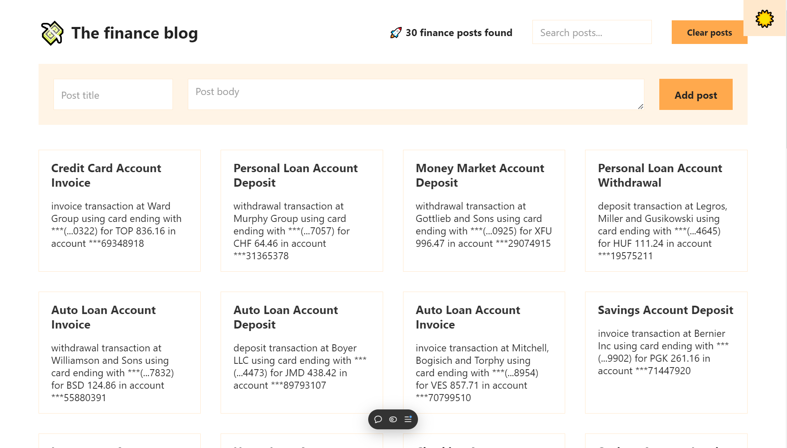

# Finance Blog App

_Modern React Application for Finance Blogging_

---

## Table of Contents

- [Overview](#overview)
- [Features](#features)
- [Technologies](#technologies)
- [Deployment](#deployment)
- [Author](#author)

---

## Overview

A responsive finance blog application utilizing **React**, **Context API**, and the **Faker library**.

## 

## Features

- Efficient state management with **React Context API**
- Mock data generation using **Faker library**
- Fully responsive design
- Scalable architecture

---

## Technologies

- **React**
- **Create React App**
- **React Context API** (useContext, Context Provider)
- **Faker library**
- **CSS**
- **JavaScript**
- **Vercel** (hosting)

---

## Deployment

# [Finance Blog App](https://finance-blog-tau.vercel.app/)

## Author

- Salah Eddine Ait Zenni
- GitHub: [salaheddineaz47](https://github.com/salaheddineaz47)

**This version fills in all the gaps and enhances the overall clarity and flow.**  
_Let me know if there's anything else you'd like to adjust!_
